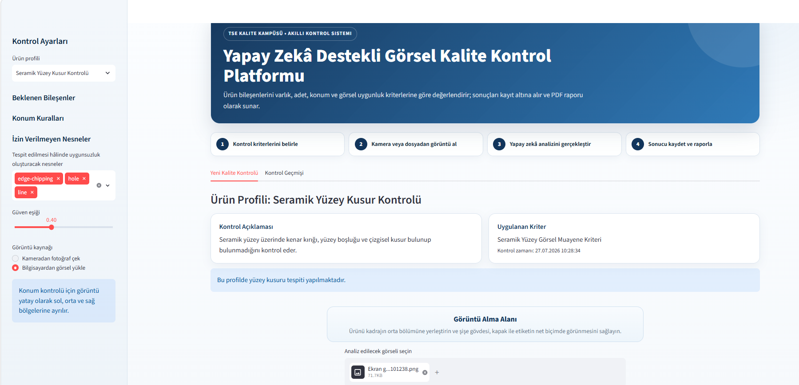
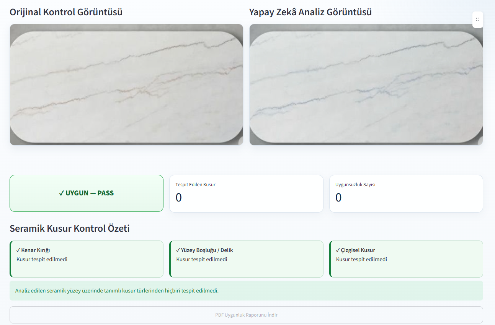
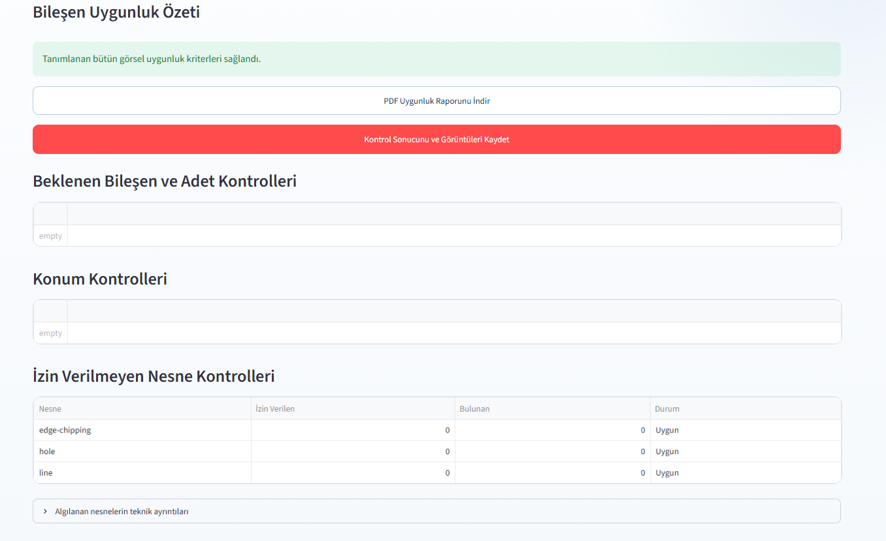

# YOLO Visual Quality Control System

YOLO ve OpenCV kullanılarak geliştirilen gerçek zamanlı görsel kalite kontrol sistemidir.

Bu projede kamera görüntüsü üzerinden ürünlerin ve ürün bileşenlerinin algılanması, belirlenen kalite kriterlerine göre kontrol edilmesi ve sonuçların raporlanması amaçlanmıştır.

## Özellikler

- Gerçek zamanlı kamera görüntüsü üzerinde nesne tespiti
- YOLO tabanlı nesne algılama
- Ürün ve ürün bileşenlerinin kontrolü
- Nesne sayısı kontrolü
- Nesnelerin konumlarının değerlendirilmesi
- Farklı ürünler için kalite kontrol profilleri
- OpenCV ile görüntü işleme
- Kontrol sonuçlarının raporlanması
- Özel veri seti ile YOLO model eğitimi

## Kullanılan Teknolojiler

- Python
- YOLO
- Ultralytics
- OpenCV
- Roboflow
- Computer Vision

## Proje Yapısı

- `app.py` — Ana uygulama dosyası
- `detector.py` — YOLO ile nesne algılama işlemleri
- `profiles.py` — Ürün kalite kontrol profilleri
- `quality_engine.py` — Kalite kontrol kurallarının değerlendirilmesi
- `image_manager.py` — Görüntü işleme işlemleri
- `database_manager.py` — Veritabanı işlemleri
- `report_generator.py` — Kontrol sonuçlarının raporlanması
- `collect_images.py` — Eğitim görüntülerinin toplanması
- `train_ceramic.py` — Özel YOLO modelinin eğitilmesi
- `dashboard_v4.py` — Kullanıcı arayüzü

## Projenin Amacı

Projenin temel amacı, bilgisayarlı görü ve nesne tespiti yöntemlerinden yararlanarak görsel kalite kontrol süreçlerinin otomatikleştirilmesidir.

YOLO modeli kullanılarak ürün ve ürün bileşenleri tespit edilmekte, OpenCV ile gerçek zamanlı kamera görüntüleri işlenmekte ve elde edilen sonuçlar belirlenen kalite kontrol kurallarına göre değerlendirilmektedir.

## Geliştirme Süreci

Proje kapsamında görüntüler toplanmış, veri setleri hazırlanmış ve YOLO modelleri kullanılarak nesne tespiti gerçekleştirilmiştir.

Farklı ürünler için kontrol profilleri oluşturulmuş ve tespit edilen nesnelerin adet, konum ve bileşen uygunluğu gibi kriterlere göre değerlendirilmesine yönelik modüller geliştirilmiştir.

## Gelecek Geliştirmeler

- Daha fazla ürün kategorisinin desteklenmesi
- Veri setinin genişletilmesi
- Model doğruluğunun artırılması
- Barkod ve etiket kontrollerinin geliştirilmesi
- Raporlama sisteminin genişletilmesi

## Ekran Görüntüleri

### Uygulama Arayüzü

### Gerçek Zamanlı Nesne Tespiti

### Analiz ve Kalite Kontrol Sonucu

## Örnek Rapor

Proje tarafından oluşturulan örnek kalite kontrol raporuna aşağıdaki bağlantıdan ulaşılabilir:

[Örnek Kalite Kontrol Raporunu Görüntüle](sample-quality-report.pdf)
